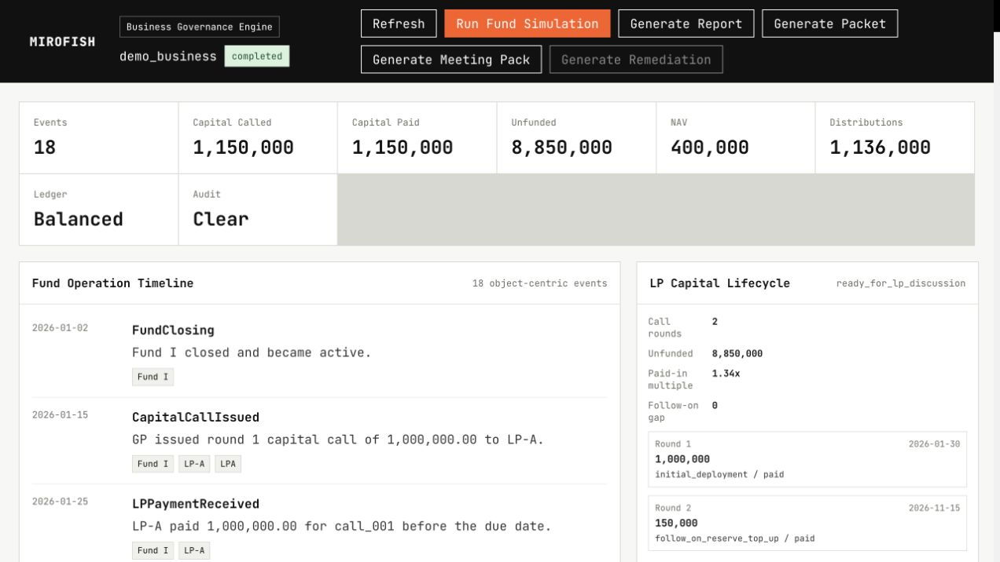

# 非技術基金經理人試用邀請包

這份文件是給不需要 GitHub、不需要技術背景的基金經理人、前輩、LP-facing reviewer 或顧問看的。所有內容都使用 synthetic demo，不包含真實 LP、基金文件、投資人身份、銀行資訊、稅務紀錄、法律意見、會計紀錄或投資建議。

## 對外發送版本

如果要直接發給非技術 reviewer，只發這一份：

- [中文版 PDF](./MiroFish_Fund_Governance_Nontechnical_Reviewer_Pack_ZH.pdf)

DOCX 和 PDF 是同一份內容。PDF 是對外發送版本；DOCX 只是日後需要修改文字時使用的 editable backup。Markdown 版本主要作為 repo 內的 source note。如果你單獨下載這個 `.md` 檔而沒有一起下載 `assets/` folder，下面的截圖可能不會顯示。

## 一句話說明

MiroFish Fund Governance Edition 是一個基金治理模擬工具，用來演練 capital call、fund terms、waterfall、IC / LPAC 決策、LP 溝通、證據軌跡和 meeting pack 準備。

## Demo 頁面截圖

下圖是 synthetic fund simulation 完成後的本地 demo 畫面。

## 完成後報告會長什麼樣子

完成後的 sample report 會讓 reviewer 看見：

- 基金運作 timeline。
- Capital called / paid / unfunded commitment。
- NAV 和 distributions 摘要。
- Governance questions。
- 是否已經接近可以放進 LP update、IC review 或 LPAC discussion 的材料。
- 法律、稅務、會計、投資建議的邊界。

## Synthetic Sample Metrics

| 指標 | Synthetic Result | Reviewer 要看什麼 |
| --- | ---: | --- |
| Events | 18 | 是否能形成可追蹤的基金運作 timeline。 |
| Capital called | 1,150,000 | Capital call 是否清楚可檢查。 |
| Capital paid | 1,150,000 | Synthetic LP 是否按時付款。 |
| Unfunded commitment | 8,850,000 | 未出資承諾是否能用來做後續規劃。 |
| NAV | 400,000 | Portfolio value 是否和現金分配分開呈現。 |
| Distributions | 1,136,000 | Distribution / waterfall 邏輯是否可被 reviewer 檢查。 |

## 想請你幫忙看的三個問題

1. 如果你是基金經理人或 LP-facing advisor，這份 output 哪一部分最可能在真實對話裡有用？
2. 哪一部分還不清楚、太技術、或還不夠可信？
3. 如果要讓你願意把這個介紹給另一位基金經理人、LP、IC member 或 LPAC reviewer，還需要補什麼？

## 建議傳送訊息

Hi [Name]，

我最近在測一個早期版本的 MiroFish Fund Governance Edition。它用 synthetic data 來演練基金運作、LP 溝通、governance review、capital call、waterfall 和 meeting pack 準備。

你不需要 GitHub，也不需要任何技術 setup。我主要想請你從基金經理人 / LP-facing 的角度，看一下畫面、sample report 和產品方向是否合理。

想請你幫我看三件事：

1. 哪一部分你覺得馬上有用？
2. 哪一部分不清楚或還不夠可信？
3. 如果要讓這個值得下一次更正式的討論，還應該補什麼？

所有資料都是 synthetic demo，不包含真實 LP 或基金資料。
